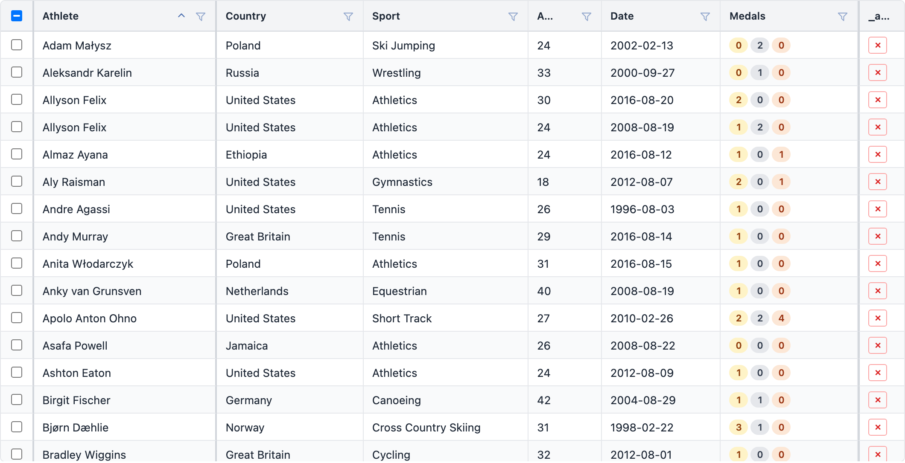
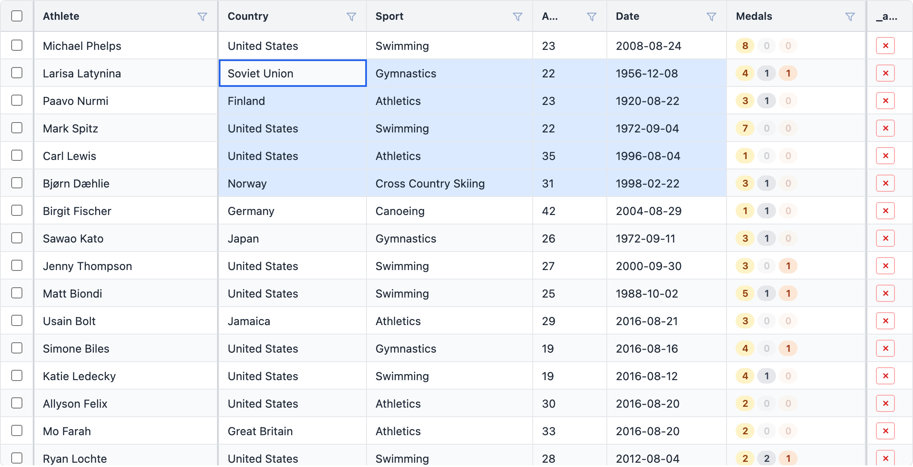
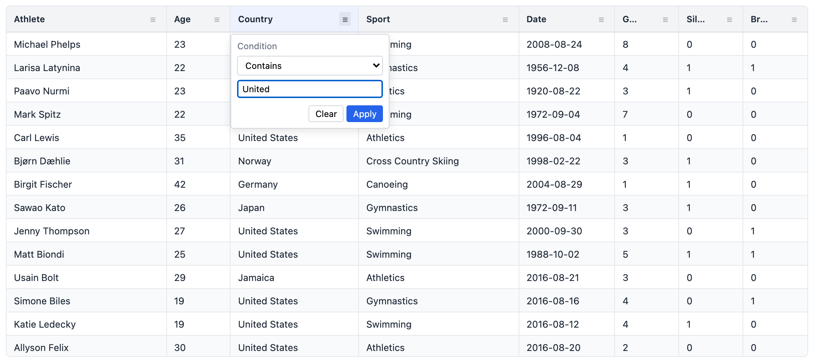
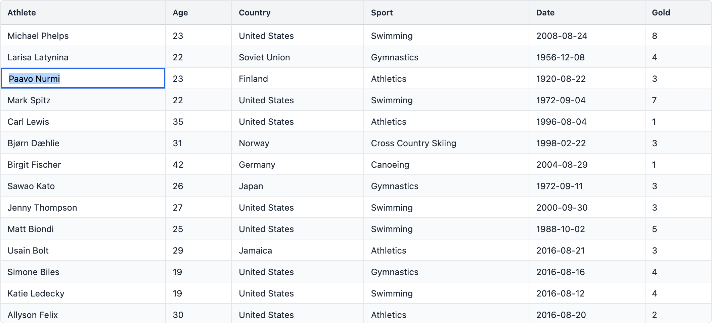
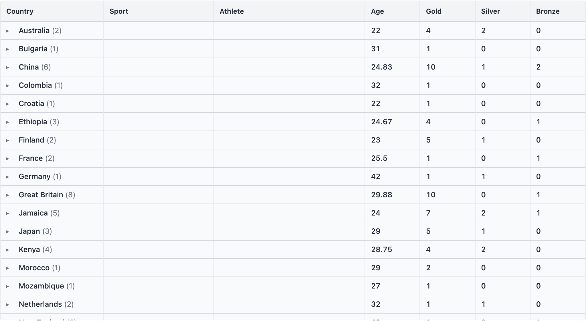
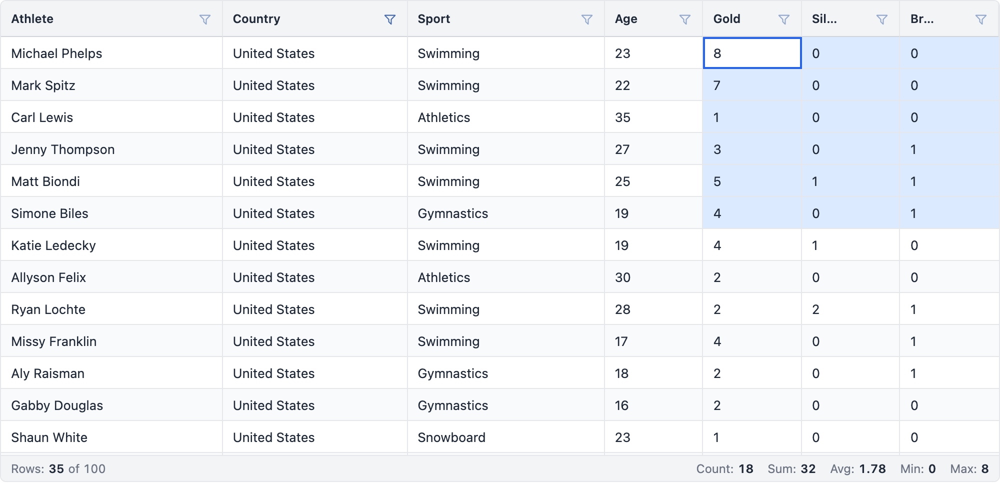
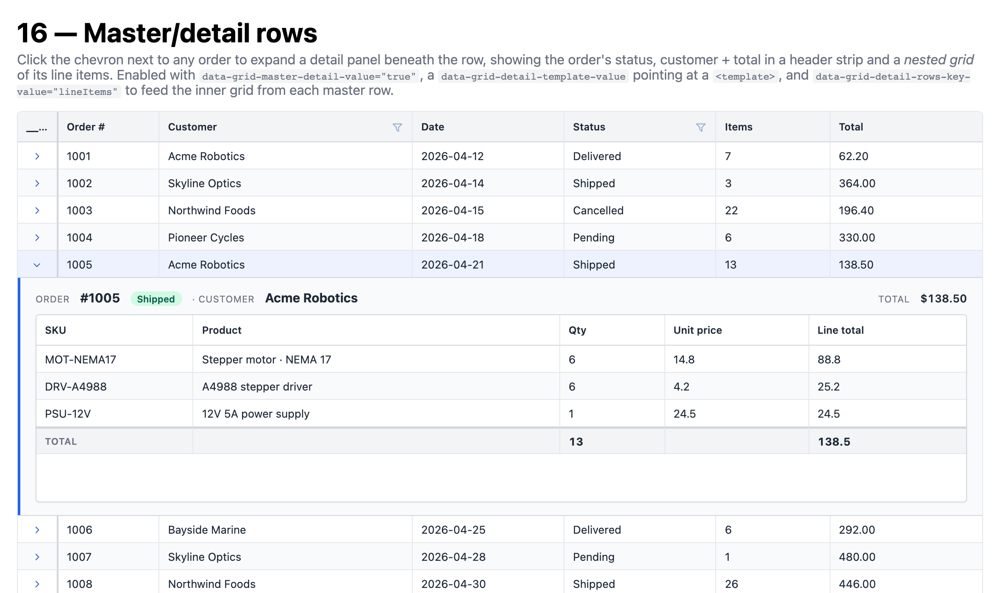

# stimulus_grid

[](https://github.com/schappim/stimulus_grid/actions/workflows/ci.yml)
[](https://www.npmjs.com/package/@ninjaai/stimulus_grid)
[](https://rubygems.org/gems/stimulus_grid_rails)

An **HTML-first data grid for [Stimulus.js](https://stimulus.hotwired.dev/) (Hotwire)**.
Drop `data-controller="grid"` on a `<table>`, describe columns with `data-*`
attributes, and you get sort, filter, global search, single/multi selection,
pagination, inline editing, custom cell renderers **and editors**, column
resize/reorder/pin/hide, virtual scrolling for large datasets, row grouping with per-group aggregation, a spreadsheet-style **status bar** with live range aggregates, **pivot mode** with a drag-driven **side panel** for groups/pivots/values, **multi-row column header groups** (auto-derived in pivot mode), a sticky **pinned bottom row** for grand totals, a **right-click column menu** for one-click pin/hide/group/pivot/aggregate, **persisted column state** that round-trips through `localStorage`, **master/detail rows** that expand to reveal a nested grid (orders → line items), **tree data** rendered from a self-referential `parent_id` (org charts, file trees, BOMs), a library of **built-in cell renderers** (email/URL/phone links, currency, percent, progress bars, star ratings, country flags, ABNs, avatars, status pills), and a public
`gridApi` — no React, no build-time config object, no third-party grid framework.
With the optional [`stimulus_grid_rails`](gem/stimulus_grid_rails) companion,
edits also **stream live to every connected client over Turbo Streams** (Action
Cable) — optimistic updates, server-side validation, and undo/redo included.

The HTML is the source of truth: a `stimulus_grid` table is a real `<table>` that
renders without JS and progressively enhances.



> Prefer the Rails/Hotwire server-driven version — live multi-user editing over
> Turbo Streams, server-side search/filter, optimistic updates, and undo/redo? It
> ships as the **`stimulus_grid_rails`** gem; see the **Rails & Hotwire** section
> below, [`gem/stimulus_grid_rails`](gem/stimulus_grid_rails), and
> [`RAILS.md`](RAILS.md). LLM usage docs live in [`skills/`](skills).

---

## Install

**Option A — plain `<script>` (no bundler).** Self-contained IIFE bundle with
Stimulus included; works over `file://`, a static server, anything. Vendor the
files from `dist/`, or load them from a CDN:

```html
<link rel="stylesheet" href="https://unpkg.com/@ninjaai/stimulus_grid/dist/stimulus_grid.css" />
<script src="https://unpkg.com/@ninjaai/stimulus_grid/dist/stimulus_grid.js"></script>
<script> StimulusGrid.start() </script>
```

**Option B — npm + a bundler (Vite, esbuild, webpack…).** Stimulus is a peer
dependency, so install it alongside:

```bash
npm install @ninjaai/stimulus_grid @hotwired/stimulus
```

```js
import { Application } from "@hotwired/stimulus"
import StimulusGrid from "@ninjaai/stimulus_grid"   // resolves to dist/stimulus_grid.esm.js
import "@ninjaai/stimulus_grid/style.css"

const app = Application.start()
StimulusGrid.start(app)                     // registers grid, header-cell, pagination, …
```

`StimulusGrid.start(app?)` registers all controllers on the given Stimulus
`Application` (or starts a new one) and returns it.

**Option C — Rails / Hotwire (gem from RubyGems).** The
[`stimulus_grid_rails`](https://rubygems.org/gems/stimulus_grid_rails) gem bundles
this grid *and* the live-sync layer, importmap-pinned — no JS build, no `dist/`
to vendor:

```bash
bundle add stimulus_grid_rails
```

Full setup (importmap, stylesheet, routes, optional migration) is in the
**Rails & Hotwire** section below.

## Quick start

```html
<link rel="stylesheet" href="dist/stimulus_grid.css" />

<div data-controller="grid"
     data-grid-pagination-value="true"
     data-grid-page-size-value="20"
     style="height: 480px">
  <table>
    <thead>
      <tr>
        <th data-controller="header-cell" data-header-cell-field-value="name"
            data-header-cell-sortable-value="true" data-header-cell-filter-value="text"
            data-header-cell-editable-value="true">Name</th>
        <th data-controller="header-cell" data-header-cell-field-value="age"
            data-header-cell-type-value="number" data-header-cell-sortable-value="true"
            data-header-cell-filter-value="number">Age</th>
      </tr>
    </thead>
    <tbody>
      <tr data-row-id="1"><td data-col-id="name">Ada</td><td data-col-id="age">36</td></tr>
      <tr data-row-id="2"><td data-col-id="name">Linus</td><td data-col-id="age">54</td></tr>
    </tbody>
  </table>
</div>

<script src="dist/stimulus_grid.js"></script>
<script>StimulusGrid.start()</script>
```

Rows can be **server-rendered** (as above — parsed into the dataset on connect),
loaded from a **URL** (`data-grid-row-data-url-value="/data.json"`), or set in JS
via `element.gridApi.setRowData([...])`.

## Screenshots

**Spreadsheet-style cell selection** — click for an active cell, click-drag or
shift-click for a range; `Cmd/Ctrl+C` copies the selection as TSV.



**Per-column filtering** — hover a header for the filter icon; popovers adapt to
the column type (text / number / date / boolean).



**Inline editing** — double-click an editable cell; type-aware editors commit on
Enter / Tab / blur and emit `grid:cellValueChanged`.



**Row grouping & aggregation** — group by one or more columns; each group row
rolls up per-column aggregates (sum / avg / min / max / count) in an auto **Group**
column on the left. Collapsed here to country subtotals:



## Grid attributes (`data-grid-*-value`)

| Attribute | Meaning |
|---|---|
| `row-data-url` | URL returning a JSON array of row objects |
| `row-selection` | `""` \| `"single"` \| `"multiple"` |
| `row-multi-select-with-click` | multi-select on plain click (no modifier) |
| `suppress-row-click-selection` | don't select on row click |
| `pagination` / `page-size` | enable paging + rows per page |
| `row-height` / `header-height` | pixel sizes |
| `virtual` / `virtual-threshold` | force virtual scrolling / auto-on threshold |
| `height` | CSS height of the scroll viewport (e.g. `"480px"`) |
| `get-row-id` | row-object field used as identity (default `id`) |
| `dom-layout` | `""` \| `"autoHeight"` |
| `server-side` / `row-count` | server-side row model: `rowData` is one page; `row-count` is the server total (drives pagination) |
| `row-group-cols` / `agg-funcs` / `group-default-expanded` / `group-reorder-columns` | row grouping: fields to group by (JSON array), per-column aggregation `{field: fn}` (JSON), default expand depth (`-1` all · `0` none · `N` levels), and whether to float grouped columns to the front while grouping (default `true`) |
| `status-bar` / `status-bar-aggs` | enable the bottom status bar (default `false`) and pick which range aggregates to show (default `["count","sum","avg","min","max"]`) |
| `pivot-mode` / `pivot-cols` | reshape into a pivot table (default `false`); `pivot-cols` is a JSON array of fields whose unique values become columns. Requires at least one `agg-funcs` entry to populate cells |
| `side-panel` | render a right-side tool panel for drag-driven row groups / pivots / value aggregations + column visibility (default `false`) |
| `column-groups` | JSON array of multi-row header groups: `[{"headerName":"Medals","children":["gold","silver","bronze"]}]`. Pivot mode auto-derives nested headers from `pivot-cols` + `agg-funcs`; this attribute is for non-pivot grids |
| `pinned-bottom-row` | render a sticky bottom row holding grand totals over the currently filtered leaves, computed from `agg-funcs` (default `false`) |
| `persist-key` | when non-empty, auto-save/restore column order, widths, pinning, visibility, row groups, pivot, value aggregations, header groups, sort, filter and pinned-bottom-row toggle to `localStorage["sgrid:" + persistKey]` |
| `master-detail` / `detail-template` / `detail-rows-key` / `detail-row-height` | enable expandable detail rows beneath each master row. `detail-template` is the id of a `<template>` cloned into each detail panel; `detail-rows-key` is the master-row field holding the nested rows array (auto-seeds an inner `[data-controller="grid"]` inside the template). `detail-row-height` is the panel's minimum pixel height (default `240`) |
| `tree-data` / `tree-parent-field` / `tree-display-field` / `tree-default-expanded` | treat `rowData` as a self-referential parent/child tree (default `false`). `tree-parent-field` names the row attribute holding the parent's id (default `"parent_id"`). `tree-display-field` picks which column hosts the indent + chevron (default: first non-gutter column). `tree-default-expanded` is `-1` all · `0` only roots · `N` first-N levels. Mutually exclusive with row groups + pivot mode |

## Column attributes (`data-header-cell-*-value`, on each `<th>`)

`field` · `header-name` · `type` (`text`\|`number`\|`date`\|`boolean`) ·
`sortable` · `filter` (`text`\|`number`\|`date`\|`boolean`\|`set`) · `editable` ·
`width` / `min-width` / `max-width` · `pinned` (`left`\|`right`) · `hidden` ·
`resizable` · `cell-renderer` (template id) · `cell-editor` (template id) ·
`checkbox` (selection checkbox column).

## Public API — `element.gridApi`

Available after the `grid:ready` event. Highlights:

- **Data:** `setRowData(rows)`, `getRowData()`, `applyTransaction({add,update,remove})`, `setRowCount(total)` / `getRowCount()` (server-side)
- **Cell selection:** `getCellSelection()` (active + range), `getCellRangeValues()`, `getRangeAggregates()` (`{count,sum,avg,min,max}` for the current range, or `null`) — click for an active cell, drag/shift+click for a range, `Cmd/Ctrl+C` copies it as TSV
- **Columns:** `setColumnDefs`, `getColumnDefs`, `setColumnVisible`, `setColumnPinned`, `setColumnWidth`, `moveColumn`, `autoSizeColumn`, `autoSizeAllColumns`, `sizeColumnsToFit`
- **Sort:** `setSortModel`, `getSortModel`
- **Filter:** `setFilterModel`, `getFilterModel`, `setColumnFilter`, `setQuickFilter`, `getQuickFilter`
- **Selection:** `selectAll`, `deselectAll`, `selectRow`, `deselectRow`, `getSelectedRows`, `getSelectedRowIds`
- **Pagination:** `paginationGoToPage/FirstPage/NextPage/PreviousPage/LastPage`, `paginationSetPageSize`, `paginationGetCurrentPage/TotalPages/RowCount/PageSize`
- **Editing:** `startEditingCell({rowId, colId})`, `stopEditing(cancel?)`
- **Export:** `getDataAsCsv(opts)`, `exportDataAsCsv(opts)`
- **Row grouping:** `setRowGroupColumns([...])`, `addRowGroupColumn`, `removeRowGroupColumn`, `getRowGroupColumns`, `setColumnAggFunc(field, fn)` (`sum`/`avg`/`min`/`max`/`count`/`first`/`last`), `expandAll`, `collapseAll`
- **Pivot:** `setPivotMode(on)`, `isPivotMode()`, `setPivotColumns([...])`, `addPivotColumn`, `removePivotColumn`, `getPivotColumns`, `getPivotResultColumns()` (current synthetic pivot cols — `{field, headerName, pivotKeys, valueField, aggFunc}` — useful for driving `setSortModel` against a specific pivot)
- **Value columns** (aggregations — shared with grouping): `setValueColumns([{field,aggFunc}])`, `addValueColumn(field, aggFunc?)`, `removeValueColumn`, `getValueColumns`
- **Column header groups:** `setColumnGroups([{headerName, children:[field,...]}])`, `getColumnGroups()`
- **Pinned bottom row:** `setPinnedBottomRow(on)`, `isPinnedBottomRow()`
- **Column state:** `getColumnState()` returns a JSON-serializable snapshot (cols + groups + pivot + values + sort + filter + pinnedBottomRow); `applyColumnState(state)` restores it; with `persist-key` set, `clearPersistedState()` wipes the saved blob and `getPersistKey()` reads back the key
- **Master/detail:** `setMasterDetail(on)`, `isMasterDetail()`, `expandDetailRow(rowId)`, `collapseDetailRow(rowId)`, `toggleDetailRow(rowId)`, `expandAllDetails()`, `collapseAllDetails()`, `getDetailExpandedRowIds()`
- **Tree data:** `setTreeData(on)`, `isTreeData()`, `setTreeParentField(field)`, `expandTreeRow(rowId)`, `collapseTreeRow(rowId)`, `toggleTreeRow(rowId)`, `expandAllTreeRows()`, `collapseAllTreeRows()`, `getTreeExpandedRowIds()`

## Events (dispatched on the grid element)

`grid:ready` · `grid:rowDataChanged` · `grid:cellClicked` · `grid:rowClicked` ·
`grid:cellValueChanged` (`{rowId, colId, oldValue, newValue}`) ·
`grid:selectionChanged` · `grid:cellSelectionChanged` · `grid:rangeAggsChanged`
(`{aggs}`) · `grid:filterChanged` · `grid:sortChanged` ·
`grid:paginationChanged` · `grid:columnMoved/Pinned/Resized/Visible` ·
`grid:columnRowGroupChanged` · `grid:groupToggled` ·
`grid:columnPivotChanged` (`{pivotCols}`) · `grid:pivotModeChanged` (`{pivot}`) ·
`grid:columnValueChanged` (`{valueCols}`) ·
`grid:columnGroupsChanged` (`{columnGroups}`) ·
`grid:columnMenuOpened` (`{colId}`) · `grid:columnStateApplied` (`{state}`) ·
`grid:detailRowExpanded` / `grid:detailRowCollapsed` (`{rowId, masterRow}`) ·
`grid:detailRowMounted` (`{rowId, masterRow, detailEl, nestedGridApi}`) ·
`grid:treeRowExpanded` / `grid:treeRowCollapsed` (`{rowId, row}`) ·
`grid:treeDataChanged` (`{treeData}`).

```js
grid.addEventListener("grid:ready", (e) => e.detail.api.setRowData(rows))
grid.addEventListener("grid:cellValueChanged", (e) => console.log(e.detail))
```

## Custom cell renderers & editors (via `<template>`)

```html
<template id="badge">
  <span class="badge" data-bind="status" data-bind-attr="data-status"></span>
</template>
<template id="status-editor">
  <select data-editor-input>
    <option>active</option><option>paused</option>
  </select>
</template>

<th data-controller="header-cell" data-header-cell-field-value="status"
    data-header-cell-editable-value="true"
    data-header-cell-cell-renderer-value="badge"
    data-header-cell-cell-editor-value="status-editor">Status</th>
```

- **Renderer** clones the template per cell. `data-bind="field"` → element text =
  `row.field`; `data-bind-text` → formatted value; `data-bind-attr="name"` → set
  attribute to the cell value. Works on the root node and any descendant.
- **Editor** clones the template on edit. The control marked `[data-editor-input]`
  (or the first `input`/`select`/`textarea`) is seeded with the current value,
  focused, and read back on commit (Enter / Tab / blur).

## Built-in cell renderers

Ten functional renderers ship pre-registered — reference them by name from
`data-header-cell-cell-renderer-value`. `cell-renderer` first resolves as a
`<template>` id (the section above); when no template matches, it falls
through to the renderer registry, so templates and named renderers coexist
without conflict.


| Renderer | Use for | Notes |
|---|---|---|
| `email` | email addresses | `mailto:` anchor when valid; red text otherwise |
| `url` | links | Anchor showing `hostname[/path]`, opens in a new tab |
| `phone` | phone numbers | `tel:` anchor with AU-aware formatting |
| `currency` | money | USD by default; right-aligned, tabular-nums |
| `percent` | percentages | `N%` suffix, right-aligned |
| `progress-bar` | 0-100 values | Clamped bar; configurable colour |
| `star-rating` | ratings | Half-star precision, SVG glyphs |
| `tags` | CSV / arrays | Splits on commas → pill chips |
| `country-flag` | 2-letter ISO codes | Emoji flag + code label |
| `abn` | Australian Business Numbers | Checksum-validated → ABR lookup link; red on invalid |
| `avatar` | user references | Image (or initials) + name; reads from `window.__sgUsers`, `row[avatarField]`, or a custom `lookup` function |
| `date` | dates | `Intl.DateTimeFormat`-formatted; configurable locale + `dateStyle` |
| `datetime` | dates with time | Date + time via `Intl.DateTimeFormat`; configurable locale / `dateStyle` / `timeStyle` |
| `relative-time` | timestamps | "3 days ago" / "in 2 hours" via `Intl.RelativeTimeFormat`; absolute timestamp on hover |
| `duration` | elapsed time | `2h 14m` (compact), `02:14:32` (clock), or `2 hours 14 minutes` (words) from ms / sec / min |
| `number` | plain numbers | `Intl.NumberFormat`-formatted (comma-grouped); right-aligned, tabular-nums |
| `compact-number` | big numbers | `1.2K` / `3.4M` / `1.2B` (or `1.2 million` with `compactDisplay: 'long'`) |
| `file-size` | byte counts | Bytes → `KiB` / `MiB` / `GiB` (binary by default); pass `{ binary: false }` for `KB` / `MB` / `GB` |
| `boolean` | true / false / null | Green check / muted X / dash; recognises `true`, `1`, `"yes"`, `"on"`, etc.; `{ falseStyle: 'hidden' }` blanks false; `{ nullLabel: 'N/A' }` overrides the dash |

```html
<th data-controller="header-cell" data-header-cell-field-value="email"
    data-header-cell-cell-renderer-value="email">Email</th>
<th data-controller="header-cell" data-header-cell-field-value="rating"
    data-header-cell-cell-renderer-value="star-rating"
    data-header-cell-type-value="number">Rating</th>
<th data-controller="header-cell" data-header-cell-field-value="completion"
    data-header-cell-cell-renderer-value="progress-bar"
    data-header-cell-type-value="number">Onboarding</th>
```

### Status pills (`statusPill(colorMap, iconMap?)`)

Every "status" column in this codebase converges on the same shape — a
coloured pill with an optional icon. Register one per status column, then
reference it like any other renderer. The colour map keys are lower-cased
before lookup, so input data can be sloppy.

```js
import { registerRenderer, renderers } from "@ninjaai/stimulus_grid"

registerRenderer("subscription", renderers.statusPill({
  subscribed:       "green",
  unsubscribed:     "yellow",
  "not-subscribed": "gray",
}))

registerRenderer("fulfillment", renderers.statusPill({
  fulfilled:    "gray",  delivered: "green", "in-transit": "blue",
  pending:      "yellow", partial:   "orange", rejected:   "red",
}, {
  fulfilled:    "check-circle", delivered: "check-circle",
  "in-transit": "truck",        pending:   "clock",
  partial:      "half-circle",  rejected:  "x-circle",
}))
```

Built-in icon names: `check`, `check-circle`, `x-circle`, `clock`, `truck`,
`dot`, `circle`, `half-circle`, `alert`, `cart`. Pass a raw SVG string for
anything custom. Pill colours: `gray`, `red`, `orange`, `yellow`, `green`,
`blue`, `indigo`, `purple`, `pink`.

### Writing your own renderer

A renderer is one function. Return an element / HTML string and the grid
drops it into the `<td>`; return nothing and the renderer is assumed to
have mutated `td` directly. The grid passes the `td` so you can add
classes (right-align, etc.) without wrapping the cell content.

```js
import { registerRenderer } from "@ninjaai/stimulus_grid"

registerRenderer("severity", ({ value, td }) => {
  td.classList.add(`severity-${value}`)
  return value.toUpperCase()
})
```

See **[demo 19](demo/19-cell-renderers.html)** for every built-in side
by side.

## Row grouping & aggregation

Group rows by one or more columns and roll up per-group aggregates — turning the
grid into a lightweight reporting view. Grouping runs **client-side** and composes
with sort, filter, pagination and virtual scrolling.


Declare it on the grid element:

```html
<div data-controller="grid"
     data-grid-row-data-url-value="/athletes.json"
     data-grid-row-group-cols-value='["country", "sport"]'
     data-grid-agg-funcs-value='{"gold": "sum", "silver": "sum", "age": "avg"}'
     data-grid-group-default-expanded-value="-1">
  <!-- …columns… -->
</div>
```

| Attribute | Value |
|---|---|
| `row-group-cols` | JSON array of fields to group by, in hierarchy order (`["country","sport"]` nests sport under country) |
| `agg-funcs` | JSON map of `{ field: fn }`, where `fn` is `sum`, `avg`, `min`, `max`, `count`, `first`, or `last` |
| `group-default-expanded` | `-1` all expanded (default) · `0` all collapsed · `N` expand the first N levels |
| `group-display-type` | `'singleColumn'` (default) — auto **Group** column on the left, grouped columns hidden — or `'inline'` to put the label in the grouped column's own cell and keep it visible |
| `group-reorder-columns` | (`'inline'` mode only) float grouped columns to the front while grouping (default `true`; `false` keeps your column order) |

…or drive it at runtime through the API:

```js
const api = el.gridApi
api.setRowGroupColumns(["country"])   // [] to ungroup; multiple fields nest
api.addRowGroupColumn("sport")        // append a level
api.removeRowGroupColumn("sport")
api.setColumnAggFunc("gold", "sum")   // sum · avg · min · max · count · first · last
api.expandAll(); api.collapseAll()    // …or click a group row to toggle it
```

**How it renders.** By default the grid inserts an **auto Group column** on the
left whose cells hold the indented value + leaf `(count)` for each group row;
the columns being grouped are hidden from the main display (their values live in
the Group column). Aggregates line up under every other column on the group row.
Numeric aggregates skip non-numeric values; `count` counts leaves. Leaves stay
sorted within their group by the active sort model. Switch to
`data-grid-group-display-type-value="inline"` to put the label in the grouped
column's own cell instead and keep that column visible.

**Events:** `grid:columnRowGroupChanged` (`{ rowGroupCols }`) fires when the
grouping changes; `grid:groupToggled` (`{ groupId, expanded }`) when a group is
expanded or collapsed.

Group rows are display-only — they aren't selectable or editable, and cell
selection, CSV export and `getSelectedRows()` operate on leaf rows. Since grouping
is client-side, under the server-side row model it groups the rows currently
loaded. See **[demo 11](demo/11-row-grouping.html)** for a full example.

## Status bar

A spreadsheet-style footer that shows the row count (with the filtered/total
split when a filter is active), the selection count, and — whenever you select
a cell range — live aggregates over that range: count, sum, avg, min, max.
The same building blocks as group aggregations, scoped to the user's selection.



Enable it on the grid element:

```html
<div data-controller="grid"
     data-grid-row-data-url-value="/athletes.json"
     data-grid-status-bar-value="true"
     data-grid-status-bar-aggs-value='["count","sum","avg","min","max"]'>
  <!-- …columns… -->
</div>
```

| Attribute | Value |
|---|---|
| `status-bar` | `true` to render the footer (default `false`) |
| `status-bar-aggs` | JSON array picking which range aggregates to show, in order. Subset of `count`, `sum`, `avg`, `min`, `max` (default: all five) |

Numeric aggregates skip non-numeric cells (booleans, dates, text); `count` is
the number of non-empty cells in the selection. With multi-range selection
(`Cmd/Ctrl+click` to add ranges), the union is summarised. Group rows are not
included. Read the same numbers programmatically with `gridApi.getRangeAggregates()`
(returns `null` when there's no range), or subscribe to `grid:rangeAggsChanged`
to render your own UI. See **[demo 12](demo/12-status-bar.html)** for a working
example.

## Pivot mode & side panel

Reshape the data into a pivot table: row-group fields form the vertical axis,
the unique values of `pivot-cols` become columns, and the value fields (the
ones with an `agg-funcs` entry) aggregate into each cell. A synthetic **(All)**
totals row sits at the top; group rows underneath hold per-group aggregates;
leaf rows are aggregated away. The **side panel** on the right is a drag-driven
tool drawer that drives groups / pivot columns / value aggregations + column
visibility — the same controls as Excel pivot tables or AG-Grid's tool panel,
all going through the public `gridApi`.


Enable both on the grid element:

```html
<div data-controller="grid"
     data-grid-row-data-url-value="/athletes.json"
     data-grid-row-group-cols-value='["country"]'
     data-grid-pivot-cols-value='["sport"]'
     data-grid-agg-funcs-value='{"gold":"sum"}'
     data-grid-pivot-mode-value="true"
     data-grid-side-panel-value="true">
  <!-- …columns… -->
</div>
```

| Attribute | Value |
|---|---|
| `pivot-mode` | `true` to pivot, `false` to render normally (default `false`). Toggle at runtime with `gridApi.setPivotMode(on)` |
| `pivot-cols` | JSON array of fields whose unique values become columns (`["sport"]` → one column per sport). Multiple fields produce one column per combination, sorted by each field in order |
| `side-panel` | `true` to render the right-side drag-driven tool panel (default `false`) |

…or drive it at runtime:

```js
const api = el.gridApi
api.setPivotMode(true)
api.setRowGroupColumns(["country"])           // rows
api.setPivotColumns(["sport"])                // columns
api.setValueColumns([                         // cells (sum of gold per cell)
  { field: "gold", aggFunc: "sum" },
])
api.addPivotColumn("medal")                   // adds a second pivot dimension
api.setColumnAggFunc("gold", "avg")           // changes the agg func for one value col
```

**How it renders.** With one value field, headers show the pivot combo only
(`"Swimming"`); with multiple, they include the agg + field
(`"Swimming · sum(gold)"`). Empty intersections render blank (not `0`),
matching Excel/Sheets conventions. Filters apply to the underlying leaf rows
before the pivot, so `country = "USA"` narrows the pivot to USA-only sports.

**Sortable pivot columns.** Click any pivot column header to sort sibling
group rows by that aggregate (asc → desc → off; shift-click to add to a
multi-sort). The synthetic **(All)** totals row stays pinned at the top
regardless. Sort is preserved across renders and round-trips through
`persist-key`, so reloads remember which pivot you sorted by.


```js
// You don't normally need this — clicks on the column header do it for you.
// Programmatic equivalent: find the synthetic field id via
// gridApi.getPivotResultColumns() then drive setSortModel directly.
const swm = api.getPivotResultColumns().find(c => c.headerName === "Swimming")
api.setSortModel([{ colId: swm.field, sort: "desc" }])
```

See **[demo 17](demo/17-sortable-pivot.html)** for a focused walk-through.

**The side panel.** Mounts as an `<aside data-controller="side-panel">` inside
`.sg-grid`. Sections (top → bottom):

- **Pivot mode** — checkbox at the top
- **Columns** — every real column with a visibility checkbox + small tags
  (`group` / `pivot` / `sum`) showing where it currently appears
- **Row Groups** — drop zone for fields used as `row-group-cols`
- **Values** — drop zone for fields with aggregations. Each chip has a click-to-cycle
  agg badge (`sum → avg → count → min → max`) and an × to remove
- **Column Labels** — drop zone for `pivot-cols` (visible only in pivot mode)

Fields drag freely between sections; dropping a chip into one section removes it
from the others (a field lives in at most one of {rowGroup, pivot, value}).
Click the tab icon on the panel's right edge to collapse to just the tab strip.

**Events:** `grid:pivotModeChanged` (`{pivot}`), `grid:columnPivotChanged`
(`{pivotCols}`) and `grid:columnValueChanged` (`{valueCols}`) fire on the matching
state changes. See **[demo 13](demo/13-pivot-side-panel.html)** for the full UX.

## Column header groups (multi-row headers) & pinned bottom row

Stacked column headers and an always-visible totals row, independently
toggled. **Column header groups** wrap one or more leaf columns under a
common parent header (`Medals` over Gold / Silver / Bronze); the grid renders
as many rows as the deepest group nesting requires. In **pivot mode** the
grid auto-derives nested headers from each pivot col's `pivotKeys` + the
value field/agg — no extra config needed. The **pinned bottom row** sticks
to the floor of the body viewport regardless of scroll position and shows
grand totals over the currently filtered leaves, using the same `agg-funcs`
declarations as group/pivot aggregations.


Declare them on the grid element:

```html
<div data-controller="grid"
     data-grid-row-data-url-value="/athletes.json"
     data-grid-agg-funcs-value='{"gold":"sum","silver":"sum","bronze":"sum","age":"avg"}'
     data-grid-pinned-bottom-row-value="true"
     data-grid-column-groups-value='[
       {"headerName":"Athlete","children":["athlete","age"]},
       {"headerName":"Origin", "children":["country","sport"]},
       {"headerName":"Medals", "children":["gold","silver","bronze"]}
     ]'>
  <!-- …columns… -->
</div>
```

| Attribute | Value |
|---|---|
| `column-groups` | JSON array of `{headerName, children: [field]}`. Each leaf column appears under at most one group; cols not in any group span all header rows. v1 supports one level of grouping; pivot-derived headers can be arbitrarily deep |
| `pinned-bottom-row` | `true` renders the sticky bottom totals row (default `false`). Filtered out in pivot mode because the `(All)` totals row already serves that role at the top |

…or drive at runtime:

```js
api.setColumnGroups([{ headerName:"Medals", children:["gold","silver","bronze"] }])
api.setPinnedBottomRow(true)
```

**Auto-grouping in pivot mode.** When a pivot would otherwise produce a busy
single-row header, header groups kick in automatically:

- 1 pivot col, 1 value → flat headers (`Swimming`, `Athletics`, …)
- 1 pivot col, *M* values → 2 rows: pivot value on top, `agg(field)` underneath
- *N* pivot cols, 1 value → *N* rows: deepest pivot field becomes the leaf label
- *N* pivot cols, *M* values → *N+1* rows: every pivot field + the value tier

The two "Gold" sub-headers under different parent years don't collapse — runs
only merge when the **full path** matches up to the row above. **Events:**
`grid:columnGroupsChanged` (`{columnGroups}`). See **[demo 14](demo/14-header-groups-pinned-totals.html)** for the user-declared groups + pinned totals.

## Right-click column menu

A one-click shortcut for the most common column operations — pin,
autosize, group, pivot, aggregate, hide — without opening the side panel
or wiring API calls. **Right-click any column header** and pick. Works
out of the box; no setup attribute required.


Items are emitted only when they make sense for that column + the current
grid state, so the menu stays short:

- **Pin left / Pin right / Unpin** — depending on the col's current pin
- **Autosize this column / Autosize all columns**
- **Group by {col} / Ungroup {col}**
- **Pivot by {col} / Remove {col} from pivot** (turns pivot mode on if needed)
- **Aggregate: sum / avg / count / min / max** (shown for numeric cols or
  cols already carrying an aggregation; the active agg is marked with `✓`).
  **Remove aggregation** appears once an agg is set
- **Hide column / Show all columns**

Outside-click / `Escape` / window scroll / resize all close the menu.
Synthetic columns (row-number gutter, checkbox column, auto-Group, pivot
result) suppress the menu — they're owned by the grid and shouldn't be
poked through this surface. **Event:** `grid:columnMenuOpened` (`{colId}`)
fires every time the menu opens so analytics / docs overlays can hook in.
See **[demo 15](demo/15-context-menu-persisted-state.html)** for it in
action.

## Persisted column state

Round-trip the whole grid layout through `localStorage` so user changes
survive a page reload. Set one attribute and the grid handles the rest —
no app glue, no per-event listeners, no reload boilerplate.

```html
<div data-controller="grid"
     data-grid-row-data-url-value="/athletes.json"
     data-grid-persist-key-value="reports.athletes">
  <!-- …columns… -->
</div>
```

| Attribute | Value |
|---|---|
| `persist-key` | when non-empty, auto-save/restore the layout under `localStorage["sgrid:" + persistKey]`. Empty (default) disables persistence |

The snapshot covers everything a user can change:

- column order, widths, pinning, visibility
- row groups, pivot mode + pivot cols, value aggregations
- column header groups and the pinned-bottom-row toggle
- sort, filter and quick filter

Writes are debounced 200 ms and flushed synchronously on `beforeunload`,
so a `Cmd+R` right after a change doesn't drop state. The grid restores
once during initial load and broadcasts a single `grid:columnStateApplied`
event when it does, so subscribers (the side panel, the status bar, your
own listeners) re-render in one shot instead of reacting to every
granular change event.

Drive the same flow programmatically — useful for "save view" / "load
view" / "reset layout" buttons:

```js
const snapshot = api.getColumnState()    // JSON-safe object you can POST to your server
api.applyColumnState(snapshot)           // restore from anywhere — fires grid:columnStateApplied
api.clearPersistedState()                // wipe the localStorage blob (e.g. a "reset" button)
api.getPersistKey()                      // read back the configured key
```

See **[demo 15](demo/15-context-menu-persisted-state.html)** — change
sort / groups / pivot / values / visibility, reload, watch it stick.

## Master/detail rows

Expand any row to reveal a detail panel beneath it — a header strip, a
nested `stimulus_grid` of related rows, or arbitrary HTML cloned from a
`<template>`. The canonical use case is **orders → line items**: the master
row shows the order summary, the chevron opens a detail panel with the
line items grid and a header strip pulled from the master.



Enable it on the grid element and point at a `<template>` for the detail
shell:

```html
<div data-controller="grid"
     data-grid-master-detail-value="true"
     data-grid-detail-template-value="order-detail-tpl"
     data-grid-detail-rows-key-value="lineItems"
     data-grid-detail-row-height-value="280">
  <table>
    <thead><tr><!-- order columns… --></tr></thead>
    <tbody></tbody>
  </table>
</div>

<template id="order-detail-tpl">
  <div class="order-detail">
    <header class="order-detail-head">
      <strong>Order #<span data-detail-bind="id"></span></strong>
      <span class="status"
            data-detail-bind="status"
            data-detail-bind-attr="data-status:status"></span>
      <span class="customer" data-detail-bind="customer"></span>
    </header>
    <!-- Inner grid is auto-seeded from master.lineItems (detail-rows-key). -->
    <div data-controller="grid"
         data-grid-row-height-value="28"
         data-grid-pinned-bottom-row-value="true"
         data-grid-agg-funcs-value='{"qty":"sum","lineTotal":"sum"}'>
      <table>
        <thead><tr><!-- line-item columns… --></tr></thead>
        <tbody></tbody>
      </table>
    </div>
  </div>
</template>
```

| Attribute | Value |
|---|---|
| `master-detail` | `true` to enable the expand chevron + detail row pipeline (default `false`) |
| `detail-template` | id of a `<template>` cloned into each detail panel; supports `[data-detail-bind="<field>"]` (text), `[data-detail-bind-attr="<attr>:<field>"]` (attribute), `[data-detail-if="<field>"]` (drop the node when the field is falsy) |
| `detail-rows-key` | master-row field holding the array of nested rows; if the template contains a `[data-controller~="grid"]` child, its `data-grid-row-data-value` is seeded from `master[detailRowsKey]` before Stimulus boots it |
| `detail-row-height` | minimum pixel height for the detail shell (default `240`) |

**Behaviour.** The grid prepends a 32 px pinned-left gutter column with an
expand chevron; clicking it toggles the detail panel for that row.
Expanded state lives in memory on the grid (not in `localStorage` — detail
expansion is session-scoped, not layout). Detail rows are display-only:
they don't participate in selection, CSV export, range aggregates, or
keyboard navigation. Suppressed in pivot / grouped views (the leaves they'd
hang off have been aggregated away) and incompatible with the uniform-row
virtualisation, so the grid switches to non-virtual rendering whenever
master/detail is enabled — best fit is dozens-to-hundreds of master rows.

**Drive it programmatically:**

```js
api.setMasterDetail(true)
api.expandDetailRow(orderId)               // emits grid:detailRowExpanded
api.toggleDetailRow(orderId)               // expand ↔ collapse
api.collapseAllDetails()                   // close everything
api.getDetailExpandedRowIds()              // → [1001, 1005, …]
```

**Events.** `grid:detailRowExpanded` / `grid:detailRowCollapsed`
(`{rowId, masterRow}`) fire on toggle. `grid:detailRowMounted`
(`{rowId, masterRow, detailEl, nestedGridApi}`) fires once after the
template clones into the DOM and the inner grid (if any) has its
`gridApi` hooked up — handy for adding columns or chrome imperatively.

> All grid events bubble. If you're listening on the *outer* grid and
> nest another grid inside the detail shell, scope your handler with
> `if (e.target !== grid) return` so the inner grid's `grid:ready` /
> `grid:rowDataChanged` don't trigger your outer logic.

See **[demo 16](demo/16-master-detail.html)** for the full orders ↔
line-items example with `expand all` / `collapse all` controls and a
status read-out.

## Tree data (self-referential `parent_id`)

Rows describe a real hierarchy via `parent_id` (org chart, file tree, BOM,
comment thread). The grid flattens the tree into a display list, draws an
indent + chevron on a configured **tree column**, and routes chevron
clicks back through the public `gridApi`. Unlike **row grouping** (which
synthesises a hierarchy from column values), tree data treats every row
as a real entity — leaves and branches share the same column layout.


```html
<div data-controller="grid"
     data-grid-tree-data-value="true"
     data-grid-tree-parent-field-value="parent_id"
     data-grid-tree-display-field-value="name">
  <table>
    <thead>
      <tr>
        <th data-controller="header-cell" data-header-cell-field-value="name"
            data-header-cell-sortable-value="true">Name</th>
        <th data-controller="header-cell" data-header-cell-field-value="title">Title</th>
        <th data-controller="header-cell" data-header-cell-field-value="salary"
            data-header-cell-type-value="number">Salary</th>
      </tr>
    </thead>
    <tbody></tbody>
  </table>
</div>

<script>
  const grid = document.querySelector("[data-controller='grid']")
  grid.addEventListener("grid:ready", () => grid.gridApi.setRowData([
    { id: 1, parent_id: null, name: "CEO",            title: "CEO",            salary: 480 },
    { id: 2, parent_id: 1,    name: "VP Engineering", title: "VP Engineering", salary: 320 },
    { id: 3, parent_id: 2,    name: "Senior Engineer", title: "Senior Engineer", salary: 175 },
  ]))
</script>
```

| Attribute | Value |
|---|---|
| `tree-data` | `true` to flatten `rowData` as a tree (default `false`). Mutually exclusive with row groups + pivot mode |
| `tree-parent-field` | row field naming the parent row's id (default `"parent_id"`). A `null`/missing/self/orphan parent makes the row a root |
| `tree-display-field` | which column hosts the indent + chevron (default: first non-gutter column) |
| `tree-default-expanded` | `-1` all expanded · `0` only roots · `N` first-N levels expanded (default `-1`) |

**Behaviour notes.**

- **Filter pulls ancestors in.** When `quickFilter` or a column filter is
  active, a matching row keeps its **full ancestor chain** visible (so the
  user always sees the path to the match) and a matching *parent* keeps
  its **entire subtree** visible (so "this folder matched" shows what's
  inside). All kept rows are force-expanded for the duration of the filter.
- **Sort works per-sibling-set.** A `sortModel` reorders children within
  each parent — the tree shape is preserved.
- **No row mutation.** Per-row tree metadata (level / hasChildren /
  expanded) lives in a sidecar `treeMeta` Map keyed by row id;
  `JSON.stringify(row)` won't surface any of the grid's scaffolding.
- **Cycles + orphans handled.** A `parent_id` referring to a missing /
  cyclical / self row makes the row a root.
- **Mutually exclusive** with `row-group-cols` and `pivot-mode` — those
  assume a flat dataset.

**Events:** `grid:treeRowExpanded` / `grid:treeRowCollapsed` (`{rowId, row}`),
`grid:treeDataChanged` (`{treeData}`). See **[demo 18](demo/18-tree-data.html)**
for a worked org-chart example with expand/collapse, search-with-ancestor-
preservation, and salary-desc sibling sort.

## Rails & Hotwire (`stimulus_grid_rails`)

For Rails apps, the **[`stimulus_grid_rails`](gem/stimulus_grid_rails)** gem turns
the grid into a **server-driven, multi-user editable** grid over Turbo Streams +
Action Cable — no React, no client-side grid framework, no JS build step. Because
a Rails app knows its schema, the **server** column definition does the work a
generic client grid pushes onto the browser: auth, coercion, validation, editor
selection, computed-column cascade, and broadcasting.

**Capabilities**

- **Live multi-user editing** — every create/update/destroy broadcasts cell-grained Turbo Stream actions to all connected tabs.
- **Optimistic cell edits** — a committed cell pulses pending (blue), then the server reconciles (green flash) or reverts (red + error tooltip), with `X-Optimistic-Id` echo-suppression for the originator.
- **Server-side column registry** — per-column `type`, `editable` (boolean *or* lambda), `editor`/`editor_config`, `validate`, `concurrency`, and `computed`/`depends_on`.
- **Concurrency & validation** — version-checked edits (`lock_version` → conflict), server-side validation → revert with errors, computed-column cascade replayed as a bulk stream.
- **Rows** — create / delete (single + multi-select bulk), tab/newline bulk paste, and undo/redo backed by a server-side audit log (`Cmd/Ctrl+Z`, `Cmd/Ctrl+Shift+Z`).
- **Multi-tenancy & auth** — tenant-scoped streams (ActsAsTenant), scoped row lookups, and auth inherited from your `parent_controller`.
- **Scale** — server-side global search, per-column filtering, and a windowed server-side row model for 50–100K+ rows.

**Install** — published on RubyGems as
[`stimulus_grid_rails`](https://rubygems.org/gems/stimulus_grid_rails). Add it
with Bundler:

```bash
bundle add stimulus_grid_rails
```

```ruby
# …or pin it in your Gemfile, then run `bundle install`:
gem "stimulus_grid_rails"
```

The engine auto-registers two importmap pins (`stimulus_grid`,
`stimulus_grid_rails`) and ships the CSS, so no `bin/importmap pin` is needed:

```js
// app/javascript/application.js
import "@hotwired/turbo-rails"
import { Application } from "@hotwired/stimulus"
import StimulusGrid from "stimulus_grid"
import StimulusGridRails from "stimulus_grid_rails"

const application = Application.start()
StimulusGrid.start(application)        // grid, header-cell, pagination, …
StimulusGridRails.start(application)   // grid-sync, cell-editor + Turbo Stream actions
```

```erb
<%# app/views/layouts/application.html.erb (head) %>
<%= stylesheet_link_tag "stimulus_grid", "stimulus_grid_rails" %>
<%= javascript_importmap_tags %>
```

```ruby
# config/routes.rb
mount ActionCable.server => "/cable"
mount StimulusGridRails::Engine => StimulusGridRails.mount_path   # default "/grids"
```

Undo/redo and the audit log are opt-in — install the bundled migration when you
want them (everything else works without it):

```bash
bin/rails stimulus_grid_rails:install:migrations && bin/rails db:migrate
```

**Usage**

```ruby
# app/grids/athlete_grid.rb — one source of truth for the columns
class AthleteGrid < StimulusGridRails::Grid
  resource :athletes
  model    Athlete
  stream_name { |_user| "athletes" }

  column :athlete, type: :string,  editable: true, pinned: :left, width: 220
  column :country, type: :string,  editable: ->(row, user) { user&.admin? }   # per-row/user
  column :age,     type: :integer, editable: true, concurrency: :version_checked,
                   validate: ->(v, _r) { "must be 10–80" unless (10..80).cover?(v.to_i) }
  column :total,   type: :integer, computed: true, depends_on: %i[gold silver bronze]

  def compute_total(row) = row.gold.to_i + row.silver.to_i + row.bronze.to_i
end
```

```ruby
# app/models/athlete.rb — make the model broadcast its changes
class Athlete < ApplicationRecord
  include StimulusGridRails::Broadcastable
  broadcasts_grid AthleteGrid, stream: ->(_a) { "athletes" }
  self.locking_column = :lock_version   # needed for version-checked columns
end
```

```erb
<%# render it anywhere %>
<%= render partial: "stimulus_grid_rails/grids/grid",
           locals: { grid: AthleteGrid.new(user: current_user),
                     rows: Athlete.order(:id),
                     row_selection: "multiple", page_size: 25 } %>
```

Double-click a cell → edit → Enter commits → optimistic pending → the server
reconciles or reverts → every other connected tab updates live. A complete
runnable app is in [`gem/demo`](gem/demo); full docs in
[`gem/stimulus_grid_rails/README.md`](gem/stimulus_grid_rails/README.md) and
[`RAILS.md`](RAILS.md).

## Demos

`npm install && npx vite`, then open `http://localhost:5173/demo/` — 12 demos
covering basics, JSON data, filtering, selection, pagination, editing, custom
renderers, 10k-row virtual scroll, everything-together, live filtering, row
grouping with aggregation, and the status bar.

## Build

```bash
npm run build:lib   # builds dist/stimulus_grid.js (IIFE) + dist/stimulus_grid.esm.js (ESM) + .css
```

## Tests

```bash
npm test                          # JS core: display-list pipeline (Vitest)
cd gem/demo && bin/rails test     # Rails engine: models, controllers, Turbo Streams, audit
```

Both run on every push/PR via [GitHub Actions](.github/workflows/ci.yml).

See [`DESIGN.md`](DESIGN.md) for architecture and the full API reference, and
[`skills/`](skills) for LLM-oriented usage guides.

## License

MIT.
